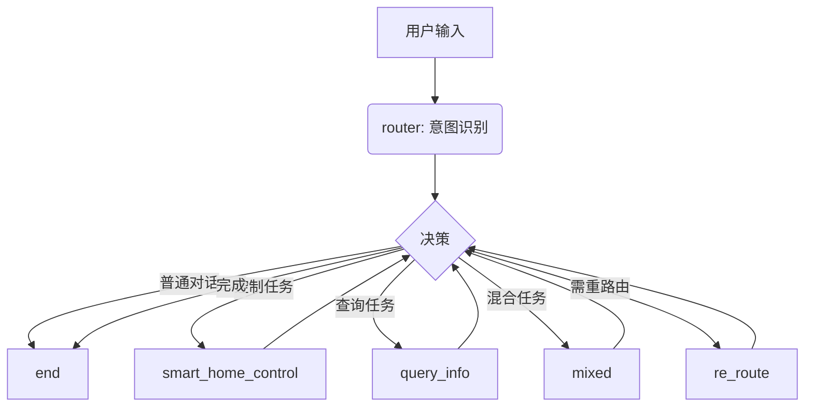

## 智能家居控制系统

使用 LangGraph 和 LangChain 制作的智能家居系统，可以通过用户需求控制智能家居 （目前智能家居控制仅仅只是 print 模拟）
系统可以识别用户自然语言意图并调用对应工具执行任务

### 系统架构
系统通过 LangGraph 定义状态流转图，核心由 ```RouterAgent``` 进行任务分流


### 支持功能
- 开关控制: “打开灯”“关闭卧室空调”
- 复合操作: “打开卧室空调并查询天气”
- 参数控制: “空调调到26度”“调亮灯光”
- 查询操作: “现在几点”“今天的天气怎么样”
- 复杂操作: “打开所有房间的灯"
- 个性化操作: “播放我喜欢的歌”

### 系统组成

- Router Agent：根据用户输入判断意图类别（控制 / 查询 / 普通 / 混合 / 重路由）
- Home Agent：处理智能家居相关控制任务
- 工具层 (Tools)：
  - 开关灯、调节灯光亮度
  - 空调控制（温度、开关、模式）
  - 音乐播放
  - 查询天气、时间、房间列表等

### 环境依赖： 
位于 requirements.txt
需要配置 OPENAI_API_KEY 和实际使用的模型
（该项目使用百炼模型，qwen3-4b）

### 启动方式
```console
python mcp_servers/wisehome_control.py
python main.py
```

系统启动后可通过命令行输入自然语言指令，例如：
- 打开卧室空调并查询天气
- 调亮灯
- 播放我喜欢的歌

| 目标 | 说明 |
|------|------|
| ✅ 稳定复合任务执行 | 优化重定向与任务分派逻辑 |
| 🔁 相对控制命令支持 | 支持“调高一点”“再亮些”类模糊控制 |
| 🧠 多轮确认机制 | 当参数缺失时自动追问（如房间、模式） |