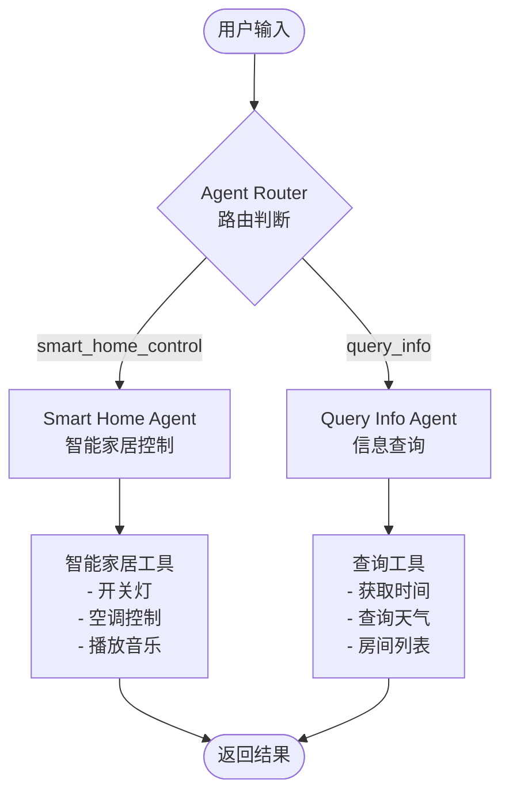
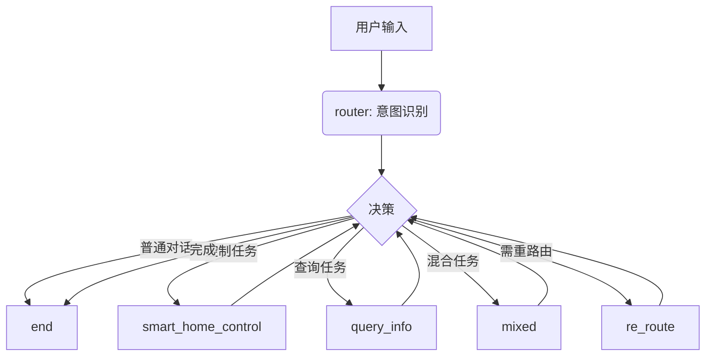

## 智能家居控制系统

使用 LangGraph 和 LangChain 制作的智能家居系统，可以通过用户需求控制智能家居 （目前智能家居控制仅仅只是 print 模拟）

使用 LangGraph 构建 state graph

```mermaid
graph TD
    Start([用户输入]) --> Router{Agent Router<br/>路由判断}
    
    Router -->|smart_home_control| HomeAgent[Smart Home Agent<br/>智能家居控制]
    Router -->|query_info| QueryAgent[Query Info Agent<br/>信息查询]
    
    HomeAgent --> HomeTools[智能家居工具<br/>- 开关灯<br/>- 空调控制<br/>- 播放音乐]
    QueryAgent --> QueryTools[查询工具<br/>- 获取时间<br/>- 查询天气<br/>- 房间列表]
    
    HomeTools --> End([返回结果])
    QueryTools --> End
    

```

```mermaid
graph TD
    A[用户输入] --> B(router: 意图识别)
    B --> C{决策}
    C -->|普通对话| D[end]
    C -->|控制任务| E[smart_home_control]
    C -->|查询任务| F[query_info]
    C -->|混合任务| G[mixed]
    C -->|需重路由| H[re_route]
    E --> C
    F --> C
    G --> C
    H --> C
    C -->|完成| D


```