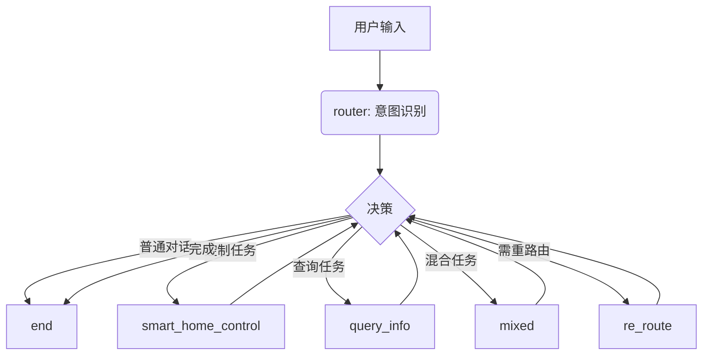

## 智能家居控制系统

使用 LangGraph 和 LangChain 制作的智能家居系统，可以通过用户需求控制智能家居 （目前智能家居控制仅仅只是 print 模拟）
系统可以识别用户自然语言意图并调用对应工具执行任务

### 系统架构
系统通过 LangGraph 定义状态流转图，核心由 ```RouterAgent``` 进行任务分流


### 支持功能
- 开关控制: “打开灯”“关闭卧室空调”
- 复合操作: “打开卧室空调并查询天气”
- 参数控制: “空调调到26度”“调亮灯光”
- 查询操作: “现在几点”“今天的天气怎么样”
- 个性化操作: “播放我喜欢的歌”

### 系统组成

- Router Agent：根据用户输入判断意图类别（控制 / 查询 / 普通 / 混合 / 重路由）
- Home Agent：处理智能家居相关控制任务
- 工具层 (Tools)：
  - 开关灯、调节灯光亮度
  - 空调控制（温度、开关、模式）
  - 音乐播放
  - 查询天气、时间、房间列表等

### 环境依赖： 
Python 3.10, langchain, langgraph, dotenv

### 启动方式
```console
python mcp_servers/wisehome_control.py
python main.py
```

系统启动后可通过命令行输入自然语言指令，例如：
- 打开卧室空调并查询天气
- 调亮灯
- 播放我喜欢的歌

| 目标 | 说明 |
|------|------|
| ✅ 稳定复合任务执行 | 优化重定向与任务分派逻辑 |
| 🔁 相对控制命令支持 | 支持“调高一点”“再亮些”类模糊控制 |
| 🧠 多轮确认机制 | 当参数缺失时自动追问（如房间、模式） |
但是我这边的常用操作有什么？现在是可以支持“打开灯，并打开空调”、“打开卧室空调，并查询天气”这样的复合操作，可以有“调亮灯”“调暗灯”这样的（另外写了工具）的操作，（还有“打开所有房间的灯”
“播放我喜欢的歌”这样奇怪的操作，主要就是需要先查询后操作并且通过工具虽然也可以实现但是我就是不想实现的操作），但是。。还有吗？难道这样就能够涵盖所有操作了？之前老师说的“调亮灯”就是
我之前没有想到过的情况，这个虽然也可以通过我的重定向路由实现，但是不知道为什么就是不太稳定，如果用工具写死会稳定很多，但是再然后呢？还有什么我没有想到过的情况吗？